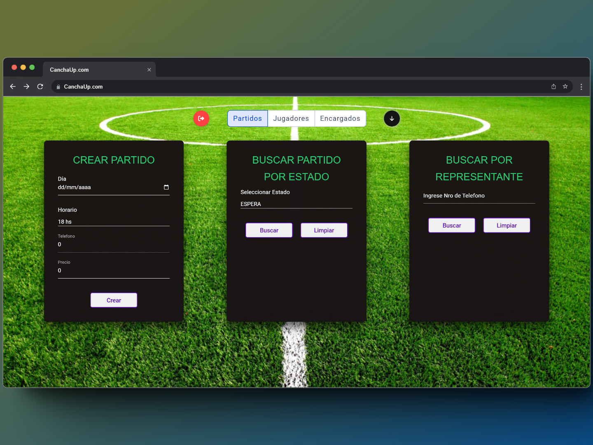

# Sistema de Reserva CanchaUp

Este repositorio contiene el código fuente del Sistema de Reserva CanchaUp, una aplicación web desarrollada con tecnologías modernas para facilitar la reserva de canchas y la organización de partidos de fútbol de manera eficiente y sencilla.

## Características Principales

- Registro y autenticación de usuarios.
- Reserva directa de canchas.
- Creación de equipos y búsqueda de rivales.
- Búsqueda de partidos aleatorios.
- Interfaz de usuario intuitiva.

## Funcionalidad de Administrador

El frontend también incluye una pestaña de administrador que permite gestionar diferentes aspectos del sistema, incluyendo partidos reservados, jugadores y encargados. Esta funcionalidad proporciona a los administradores herramientas adicionales para gestionar y supervisar el funcionamiento del sistema en su conjunto.

## Tecnologías Utilizadas

- Lenguajes de Programación: Java, TypeScript.
- Frameworks y Librerías: Apache Causeway, Angular.
- Base de Datos: PostgreSQL.
- Lenguajes de Marcado: HTML.
- Hojas de Estilo: CSS.

## Backend

El backend de esta aplicación está alojado en un repositorio separado. Puedes encontrar el código fuente y la documentación en el siguiente enlace:

[Backend-CanchaUp](https://github.com/LucaUnlimited/Backend-CanchaUp)

## Autor

Este proyecto fue desarrollado por [Rivera Luca](#) - Contacto: [lucamartinrivera@gmail.com](mailto:tuemail@example.com)
